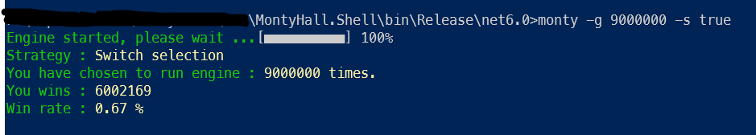

# Monty Hall problem
The Monty Hall is a brain teaser, in the form of a probability puzzle,
loosely based on the American television game show Let's Make a Deal
and named after its original host, Monty Hall.
The concept of the game is that the player sees three closed doors - behind
one is a car, and behind the other two are goats. The game starts with the
player getting to choose a door, without opening it. Then the presenter
opens one of the two remaining doors (but never the one with the car) and
shows that this door does not contain profit. The player is then given
another choice to change the door.
The question is whether the chances of winning increase if the player
changes the door.
Source: https://en.wikipedia.org/wiki/Monty_Hall_problem

# So the task is:

Build an application that proves the paradox. The application should be able to simulate a given number of games and
whether you change the door or not. The technical requirement for the solution is to build an application with a backend of
your choice, preferably C#. In the interface you should be able to enter a number of simulations and choose whether or not
to change the door. Then be able to press a button that starts the simulation by calling backend that performs the requested
number of simulated games. When backend answers then the results of the simulations should be printed. Testing should be
included in the assignment.

# How to run
1. Browse to `Monty-Hall\src\MontyHall.Shell\bin\Release\net6.0`
2. Open windows prompt inside the above folder.
3. Run the following command
    ```powershell
    monty -g 1000 -s true
    ```
    where `-g` for how many times do you want to run game engine
    `-s` to specify if you want to apply **Switch Strategy** or **Keep Selection strategy**

4. For help about what is the meaning of parameters in this command you can run help as following
    ```powershell
    monty -h
    ```
# Output

